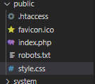

# Praktikum 11 : PHP Framework(Codeigniter)
## Nama   : Moch. Aqilla Fasha
## NIM    : 312010367
## Kelas  : TI.20.A.2
## Matkul : Pemograman Web

## Langkah-langkah!

1. Untuk mengaktifkan ekstensi tersebut, buka XAMPP Control Panel kemudian pada bagian Apache klik Config->PHP.ini

2. Kemudian pada bagian extention hilangkan tanda titik koma (;) pada ekstensi yang akan diaktifkan. Setelah selesai simpan kembali fileya dan restart Apache web server.

3. Menjalankan CLI (Command Line Interface)

4. Kemudian perintah yang dapat dijalankan untuk memanggil CLI Codeigniter adalah php spark

5. Codeigniter 4 menyediakan fitur debugging untuk memudahkan developer untuk 
mengetahui pesan error apabila terjadi kesalahan dalam membuat kode program.
Secara default fitur ini belum aktif. Ketika terjadi error pada aplikasi akan ditampilkan 
pesan kesalahan seperti berikut.

6. Ubah nama file env menjadi .env kemudian buka file tersebut dan ubah nilai variable 
CI_ENVIRINMENT menjadi development.

7. Cara untuk memperbaiki error tersebut, ubah kode pada file Home.php hilangkan titik koma(;) pada akhir kode.

8. Pada Codeigniter, request yang diterima oleh file index.php akan diarahkan ke Router 
untuk meudian oleh router tesebut diarahkan ke Controller. Pada file tersebut kita dapat mendefinisikan route untuk aplikasi yang kita buat.

9. Kemudian Untuk mengetahui route yang ditambahkan sudah benar, buka CLI dan jalankan 
perintah berikut.

10. Membuat Controller
Selanjutnya adalah membuat Controller Page. Buat file baru dengan nama page.php 
pada direktori Controller kemudian isi kodenya seperti berikut. Kemudian refresh Kembali browser, maka akan ditampilkan hasilnya yaotu halaman 
sudah dapat diakses.

11. Tambahkan method baru pada Controller Page seperti berikut.

12. Membuat view
Selanjutnya dalam membuat view untuk tampilan web agar lebih menarik. Buat file 
baru dengan nama about.php pada direktori view (app/view/about.php). Lalu ubah method about class Controller Page menjadi seperti ini.

kemudian refresh kembali halaman tersebut.

13. Membuat Layout dengan CSS
Buat file css pada direktori public dengan nama style.css (copy file dari praktikum 
lab4_layout. Kita akan gunakan layout yang pernah dibuat pada praktikum 4.

14. Membuat folder template pada direktori view kemudian buat file header.php dan 
footer.php

header.php

footer.php

15. Ubah file about.php seperti berikut.

Refresh kembali browsernya

