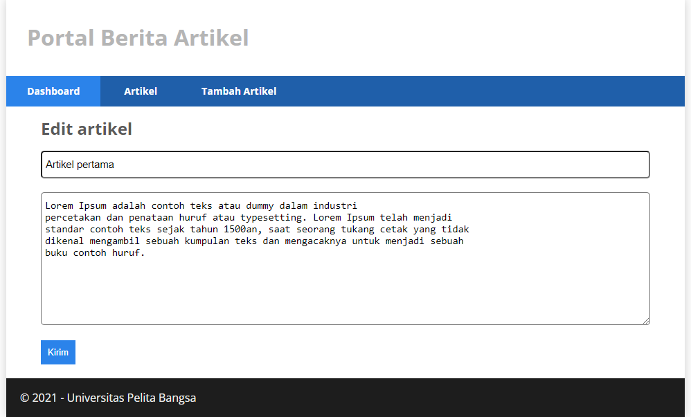

# Praktikum 12 : TUGAS LANJUTAN (CRUD)
## Nama : Moch. Aqilla Fasha
## NIM  : 312010367
## Kls  : TI.20.A.2

Langkah-langkah Praktikum serta Pertanyaan dan tugas
Persiapan.
Untuk memulai membuat aplikasi CRUD sederhana, yang perlu disiapkan adalah 
database server menggunakan MySQL. Pastikan MySQL Server sudah dapat dijalankan melalui XAMPP

Membuat Database

Membuat table dengan nama artikel

Konfigurasi koneksi database

Membuat Model

Membuat Controller
Buat Controller baru dengan nama Artikel.php pada direktori app/Controllers.

Membuat view

Selanjutnya buka browser

Belum ada data yang diampilkan. Kemudian coba tambahkan beberapa data pada 
database agar dapat ditampilkan datanya.

kemudian refresh kembali browsernya.

Membuat Tampilan Detail Artikel
Tampilan pada saat judul berita di klik maka akan diarahkan ke halaman yang berbeda. 
Tambahkan fungsi baru pada Controller Artikel dengan nama view().

Membuat View Detail
Buat view baru untuk halaman detail dengan nama app/views/artikel/detail.php.

Membuat Routing untuk artikel detail
Buka Kembali file app/config/Routes.php, kemudian tambahkan routing untuk artikel detail.

Refresh kembali browser, lalu pilih salah satu artikel sehingga akan ditampilkan hasilnya.

Membuat menu admin
Menu admin adalah untuk proses CRUD data artikel. Buat method baru pada Controller Artikel dengan nama admin_index().

Membuat file baru pada bagian views/artikel/ dengan nama admin_index.php

Lalu tambahkan menu admin pada Routes.

maka akan menampilkan seperti gambar berikut.

Menambahkan method baru pada Controlerr Artikel dengan nama add().

Menambahkan artikel baru

Lalu buat file baru dengan nama form_add.php pada bagian views/artikel/.

Ubah data
Tambahkan method baru pada bagian Controller/artikel dengan nama edit().

Menghapus data

