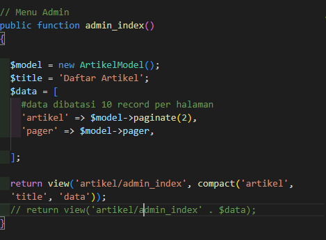
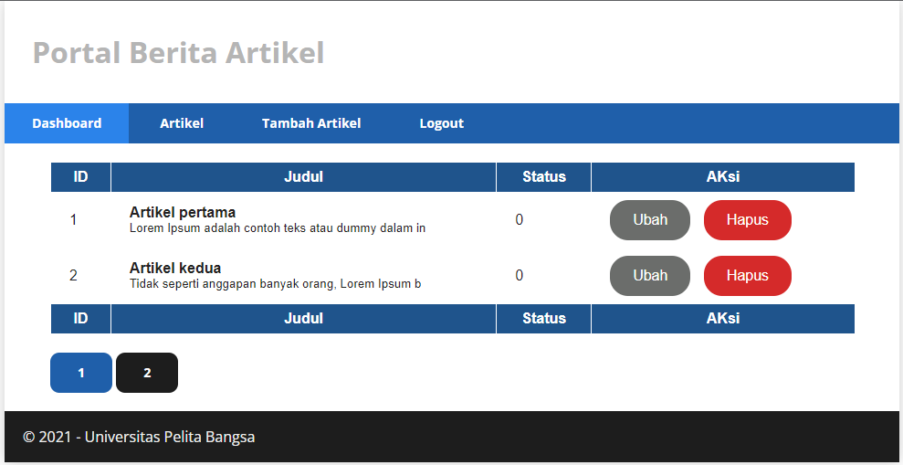
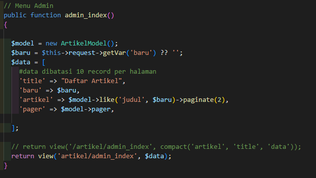
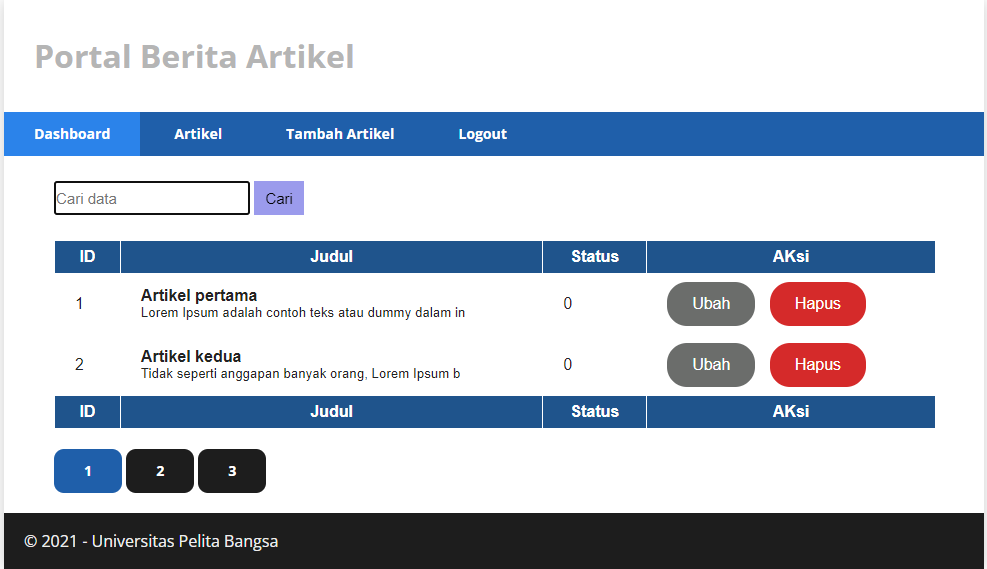
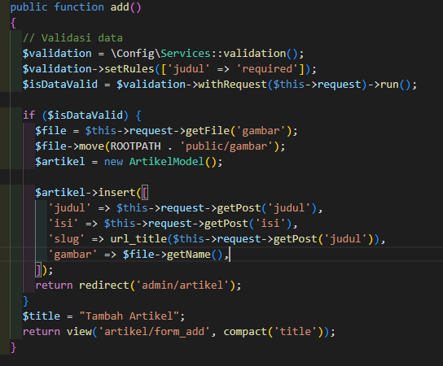
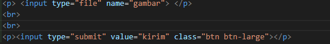
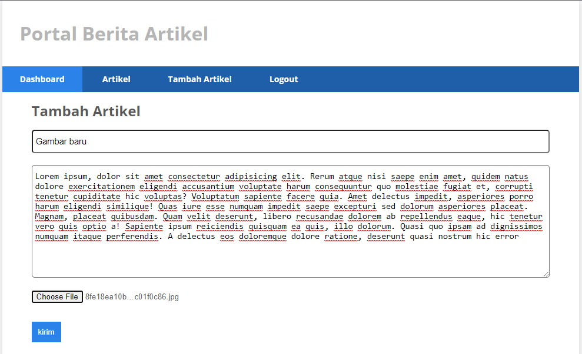
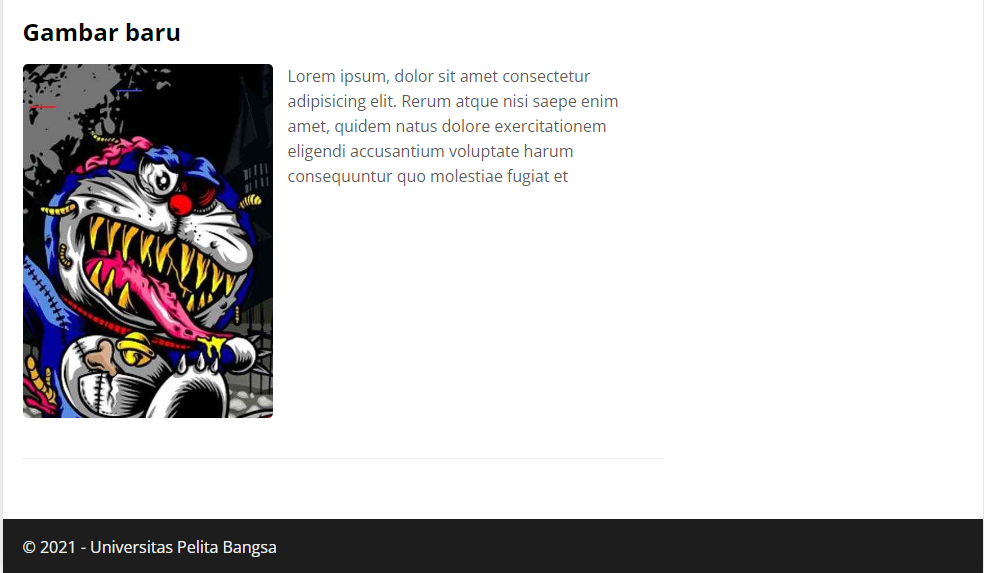

# Praktikum 14 : Pagination dan Pencarian
## Nama : Moch. Aqilla Fasha
## NIM  : 312010367
## Kls  : TI.20.A.2

MEMBUAT PAGINATION
buka Kembali Controller Artikel, kemudian modifikasi kode pada method admin_index seperti berikut.

Selanjutnya buka kembali menu daftar artikel, tambahkan data lagi untuk melihat hasilnya.

MEMBUAT PENCARIAN
Untuk membuat pencarian data, buka kembali Controller Artikel, pada method admin_index ubah kodenya seperti berikut.

Kemudian buka kembali file views/artikel/admin_index.php dan tambahkan form pencarian sebelum deklarasi tabel seperti berikut.

[2_1.png](img/2_1.png)

Selanjutnya ujicoba dengan membuka kembali halaman admin artikel, masukkan kata kunci tertentu pada form pencarian.

UPLOAD GAMBAR
Menambahkan fungsi unggah gambar pada tambah artikel. Buka kembali Controller Artikel, sesuaikan kode pada method add seperti berikut.

Kemudian pada file views/artikel/form_add.php tambahkan field input file seperti berikut.

Ujicoba file upload dengan mengakses menu tambah artikel.

