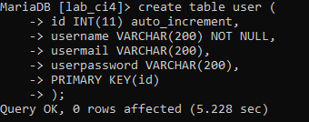
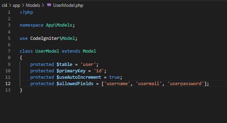
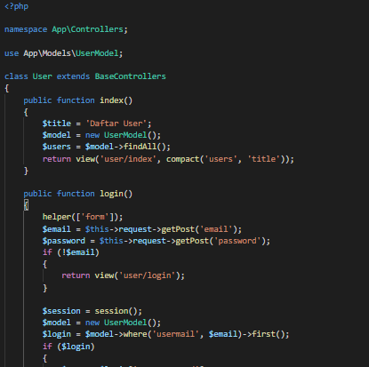
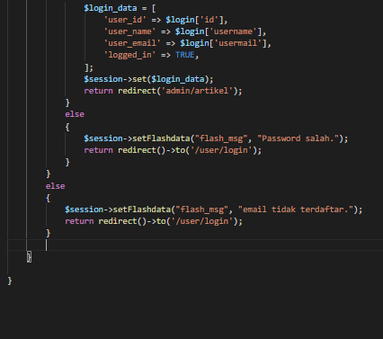
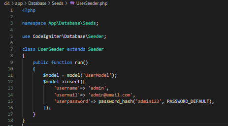
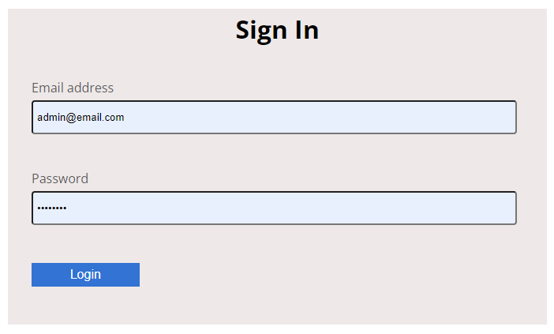
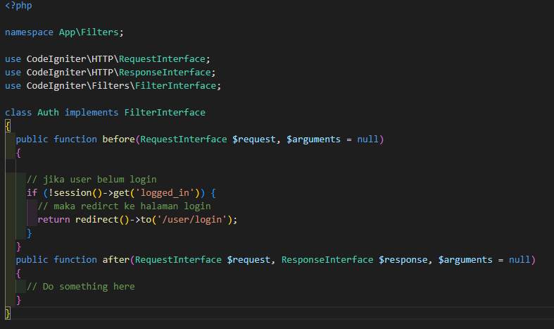
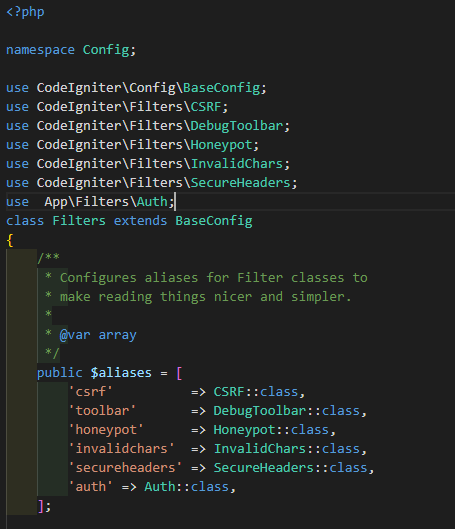
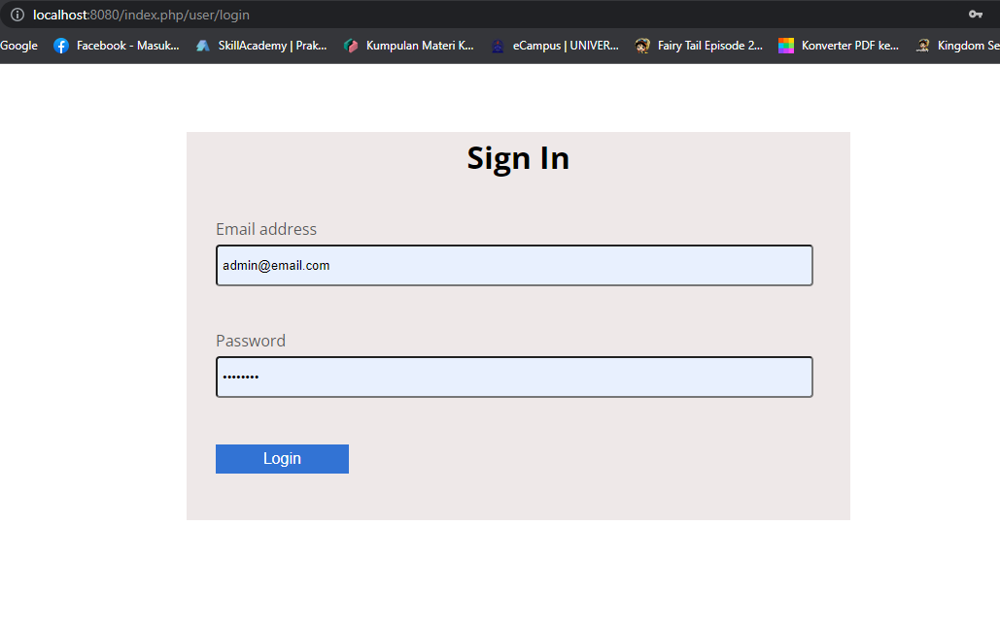
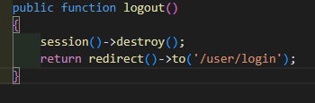

# Praktikum 13 : FrameWork Lanjutan (Modul Login)
## Nama : Moch. Aqilla Fasha
## NIM  : 312010367
## Kls  : TI.20.A.2

Membuat tabel user

Membuat model user
Buat file baru dengan nama UserModel.php pada direktori app/Models

Buat Controller baru dengan nama User.php pada direktori app/Controllers. Kemudian tambahkan method index() untuk menampilkan daftar user, dan method login() untuk proses login.

Membuat view login

Selanjutnya, buka file UserSeeder.php yang berada di lokasi direktori /app/Database/Seeds/UserSeeder.php kemudian isi dengan kode berikut:

Uji coba login

Menambah Auth Filter

Selanjutnya buka file app/Config/Filters.php tambahkan kode berikut:

buka file app/Config/Routes.php dan sesuaikan kodenya.

Percobaan Akses Menu admin

Tambahkan method logout pada Controller User seperti berikut:

